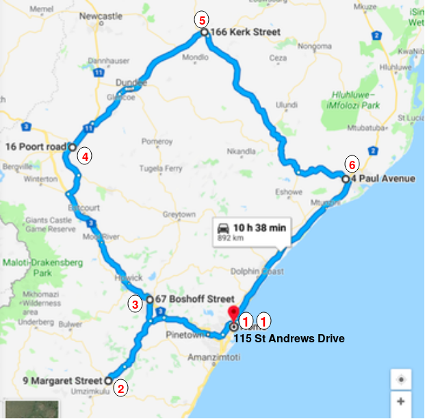

# Spatial Optimisation Problem


Formally, the problem asks to find the optimal time (minimum time) route between different locations in KwaZulu Natal.The locations are as folllow:
1. 115 St Andrews Drive, Durban North, KwaZulu Natal, South Africa
2. 67 Boshoff Street, Pietermaritzburg, KwaZulu Natal, South Africa
3. 4 Pual Avenue, Fairview, Empangeni, KwaZulu Natal, South Africa
4. 166 Kerk Street, Vryheil, KwaZulu Natal, South Africa
5. 9 Margaret Street, Ixopo, KwaZulu Natal, South Africa
6. 16 Poort Road, Ladysmith, Durban North, KwaZulu Natal, South Africa

Informally, you have a delivery driver who wants to visit a number of delivery address locations and wants to find the shortest path to visit all the locations.

An exhaustive search of all possible paths would be guaranteed to find the shortest, but is computationally intractable for all but small sets of locations. For larger problems, optimization techniques are needed to intelligently search the solution space and find near-optimal solutions. 

## Travelling Salesman Problem
The travelling salesman problem (TSP) asks the following question: "Given a list of cities and the distances between each pair of cities, what is the shortest possible route that visits each city and returns to the origin city ? Wesolve the above mentioned sptial optimisation problem by using this approach

##  Solving TSPs with OR-Tools
You can solve TSPs using the OR-Tools [vehicle routing library](https://developers.google.com/optimization/reference/constraint_solver/routing/), a collection of algorithms designed especially for TSPs, and more general problems with multiple vehicles. The routing library is an added layer on top of the [constraint programming](https://developers.google.com/optimization/cp/) solver. See [RoutingModel](https://developers.google.com/optimization/reference/constraint_solver/routing/RoutingModel/) for detailed information about the available methods for setting up and solving routing problems.
___


## Installation
```
pip install ortools
```
### The following section represent python program that solves the obove mentioned problem. 


The data for the problem: the lovcations and the distance matrix, whose entry in row i and column j is the distance from location i to location j in km. The figure shows the distance matrix between each location.


### The following code declares an instance of the solver and sets the default options for it.
```
  tsp_size = len(address_names)
  num_routes = 1
  depot = 0

  # Create routing model
  if tsp_size > 0:
    routing = pywrapcp.RoutingModel(tsp_size, num_routes, depot)
    search_parameters = pywrapcp.RoutingModel.DefaultSearchParameters()
    # Create the distance callback.
    dist_callback = create_distance_callback(dist_matrix)
    routing.SetArcCostEvaluatorOfAllVehicles(dist_callback)
```
The instance solver is declared by 
```
routing = pywrapcp.RoutingModel(tsp_size, num_routes, depot)
# Description of each variable
   # tsp_size—The number of locations needed to be visited.
   # num_routes—The number of routes, which is 1 for a TSP.
   #  depot—The start and end node of the route.
```
The following funstion is distance call back which calculates the distance between two locations. It then returns the calculated distance call back to the solver.
```
def create_distance_callback(dist_matrix):
  # Create a callback to calculate distances between cities.

  def distance_callback(from_node, to_node):
    return int(dist_matrix[from_node][to_node])

  return distance_callback
```
For a pair of locations, whose indices in the distance matrix are from_node and to_node, the callback accepts the two indices and returns the corresponding entry of the distance matrix. This is checke for all the route combinationation for each selected node.

## Running the program

After running the tsp ipython notebook scrip, the main function returns the optimal route in terms of distance and the locations in optimal route pattern. The figure below shows the optimal route pattern. 

The travelling salesman simulated results for the optimal route acheive an optimal distance and of 891km 9h 37 min, respectively. When the optimal route was traced on Google Map achieve an optimal route distance and time of about 892km and 10h 9min. 

# Credits

[Google OR-Tools](https://developers.google.com)

[Ant colonies for the travelling salesman problem](https://www.sciencedirect.com/science/article/pii/S0303264797017085)
